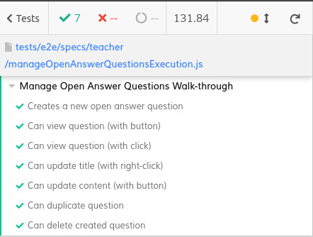

# ES21 P3 submission, Group 21
## Feature PRA

### Subgroup

 - João Oliveira, ist193728, Jonyleo
   + Issues assigned: [#154](https://github.com/tecnico-softeng/es21-g21/issues/154), [#155](https://github.com/tecnico-softeng/es21-g21/issues/155),
[#156](https://github.com/tecnico-softeng/es21-g21/issues/156), [#171](https://github.com/tecnico-softeng/es21-g21/issues/171), [#185](https://github.com/tecnico-softeng/es21-g21/issues/185),
[#186](https://github.com/tecnico-softeng/es21-g21/issues/186), [#195](https://github.com/tecnico-softeng/es21-g21/issues/195), [#196](https://github.com/tecnico-softeng/es21-g21/issues/196),
[#197](https://github.com/tecnico-softeng/es21-g21/issues/197)
 - Filipa Malta, ist193708, pipamalta
   + Issues assigned: [#160](https://github.com/tecnico-softeng/es21-g21/issues/160), [#161](https://github.com/tecnico-softeng/es21-g21/issues/161),
[#162](https://github.com/tecnico-softeng/es21-g21/issues/162), [#163](https://github.com/tecnico-softeng/es21-g21/issues/163), [#164](https://github.com/tecnico-softeng/es21-g21/issues/164),
[#167](https://github.com/tecnico-softeng/es21-g21/issues/167), [#168](https://github.com/tecnico-softeng/es21-g21/issues/168), [#174](https://github.com/tecnico-softeng/es21-g21/issues/174),
[#175](https://github.com/tecnico-softeng/es21-g21/issues/175), [#176](https://github.com/tecnico-softeng/es21-g21/issues/176)
 
### Pull requests associated with this feature

The list of pull requests associated with this feature is:

 - [PR #158](https://github.com/tecnico-softeng/es21-g21/pull/158)
 - [PR #166](https://github.com/tecnico-softeng/es21-g21/pull/166)
 - [PR #173](https://github.com/tecnico-softeng/es21-g21/pull/173)
 - [PR #179](https://github.com/tecnico-softeng/es21-g21/pull/179)
 - [PR #188](https://github.com/tecnico-softeng/es21-g21/pull/188)
 - [PR #198](https://github.com/tecnico-softeng/es21-g21/pull/198)

### Frontend

#### New/Updated Views

 - [EditQuestionSubmissionDialog.vue](https://github.com/tecnico-softeng/es21-g21/blob/develop/frontend/src/views/questionsubmission/EditQuestionSubmissionDialog.vue)
 - [EditQuestionDialog.vue](https://github.com/tecnico-softeng/es21-g21/blob/develop/frontend/src/views/teacher/questions/EditQuestionDialog.vue)
 - [ShowQuestion.vue](https://github.com/tecnico-softeng/es21-g21/blob/develop/frontend/src/views/teacher/questions/ShowQuestion.vue)

#### New/Updated Models

 - [OpenAnswerStatementAnswerDetails.ts](https://github.com/tecnico-softeng/es21-g21/blob/develop/frontend/src/models/statement/questions/OpenAnswerStatementAnswerDetails.ts)
 - [OpenAnswerStatementCorrectAnswerDetails.ts](https://github.com/tecnico-softeng/es21-g21/blob/develop/frontend/src/models/statement/questions/OpenAnswerStatementCorrectAnswerDetails.ts)
 - [OpenAnswerStatementQuestionDetails.ts](https://github.com/tecnico-softeng/es21-g21/blob/develop/frontend/src/models/statement/questions/OpenAnswerStatementQuestionDetails.ts)
 - [OpenAnswerAnswerDetails.ts](https://github.com/tecnico-softeng/es21-g21/blob/develop/frontend/src/models/management/questions/OpenAnswerAnswerDetails.ts)
 - [OpenAnswerQuestionDetails.ts](https://github.com/tecnico-softeng/es21-g21/blob/develop/frontend/src/models/management/questions/OpenAnswerQuestionDetails.ts)

### End-to-end tests

#### Created tests

 - [Creates a new open answer question](https://github.com/tecnico-softeng/es21-g21/blob/8ae5688555f875f165484a18b2baa861381f389e/frontend/tests/e2e/specs/teacher/manageOpenAnswerQuestionsExecution.js#L45)
 - [Can view question (with button)](https://github.com/tecnico-softeng/es21-g21/blob/8ae5688555f875f165484a18b2baa861381f389e/frontend/tests/e2e/specs/teacher/manageOpenAnswerQuestionsExecution.js#L89)
 - [Can view question (with click)](https://github.com/tecnico-softeng/es21-g21/blob/8ae5688555f875f165484a18b2baa861381f389e/frontend/tests/e2e/specs/teacher/manageOpenAnswerQuestionsExecution.js#L105)
 - [Can update title (with right-click)](https://github.com/tecnico-softeng/es21-g21/blob/8ae5688555f875f165484a18b2baa861381f389e/frontend/tests/e2e/specs/teacher/manageOpenAnswerQuestionsExecution.js#L117)
 - [Can update content (with button)](https://github.com/tecnico-softeng/es21-g21/blob/8ae5688555f875f165484a18b2baa861381f389e/frontend/tests/e2e/specs/teacher/manageOpenAnswerQuestionsExecution.js#L148)
 - [Can duplicate question](https://github.com/tecnico-softeng/es21-g21/blob/8ae5688555f875f165484a18b2baa861381f389e/frontend/tests/e2e/specs/teacher/manageOpenAnswerQuestionsExecution.js#L179)
 - [Can delete created question](https://github.com/tecnico-softeng/es21-g21/blob/8ae5688555f875f165484a18b2baa861381f389e/frontend/tests/e2e/specs/teacher/manageOpenAnswerQuestionsExecution.js#L221)

#### Screenshot of test results overview

---

## Feature PEM

### Subgroup

- Catarina Sousa, 93695, @catasofia
   + Issues assigned: [#180](https://github.com/tecnico-softeng/es21-g21/issues/180), [#189](https://github.com/tecnico-softeng/es21-g21/issues/189), [#190](https://github.com/tecnico-softeng/es21-g21/issues/190), [#191](https://github.com/tecnico-softeng/es21-g21/issues/191), [#201](https://github.com/tecnico-softeng/es21-g21/issues/201), [#202](https://github.com/tecnico-softeng/es21-g21/issues/202), [#204](https://github.com/tecnico-softeng/es21-g21/issues/204), [#209](https://github.com/tecnico-softeng/es21-g21/issues/209), [#210](https://github.com/tecnico-softeng/es21-g21/issues/210)
- Nelson Trindade, 93743, @nelsontr
   + Issues assigned: [#177](https://github.com/tecnico-softeng/es21-g21/issues/177), [#181](https://github.com/tecnico-softeng/es21-g21/issues/181), [#182](https://github.com/tecnico-softeng/es21-g21/issues/182), [#193](https://github.com/tecnico-softeng/es21-g21/issues/193), [#194](https://github.com/tecnico-softeng/es21-g21/issues/194), [#199](https://github.com/tecnico-softeng/es21-g21/issues/199), [#203](https://github.com/tecnico-softeng/es21-g21/issues/203), [#206](https://github.com/tecnico-softeng/es21-g21/issues/206), [#207](https://github.com/tecnico-softeng/es21-g21/issues/207), [#211](https://github.com/tecnico-softeng/es21-g21/issues/211), [#212](https://github.com/tecnico-softeng/es21-g21/issues/212)

### Pull requests associated with this feature

The list of pull requests associated with this feature is:

- [PR #183](https://github.com/tecnico-softeng/es21-g21/pull/183)
- [PR #192](https://github.com/tecnico-softeng/es21-g21/pull/192)
- [PR #200](https://github.com/tecnico-softeng/es21-g21/pull/200)
- [PR #205](https://github.com/tecnico-softeng/es21-g21/pull/205)
- [PR #208](https://github.com/tecnico-softeng/es21-g21/pull/208)

### Frontend

#### New/Updated Models

- [Option](https://github.com/tecnico-softeng/es21-g21/blob/develop/frontend/src/models/management/Option.ts)
- [MultipleChoiceQuestionDetails](https://github.com/tecnico-softeng/es21-g21/blob/develop/frontend/src/models/management/questions/MultipleChoiceQuestionDetails.ts)

#### New/Updated Components

- [MultipleChoiceCreate](https://github.com/tecnico-softeng/es21-g21/blob/develop/frontend/src/components/multiple-choice/MultipleChoiceCreate.vue)
- [MultipleChoiceView](https://github.com/tecnico-softeng/es21-g21/blob/develop/frontend/src/components/multiple-choice/MultipleChoiceView.vue)

### End-to-end tests

#### Created tests

- [Create a new multiple choice question w/ two correct options](https://github.com/tecnico-softeng/es21-g21/blob/develop/frontend/tests/e2e/specs/teacher/manageMultipleCorrectChoiceQuestionsExecution.js#L76)
- [Can view question (with button)](https://github.com/tecnico-softeng/es21-g21/blob/develop/frontend/tests/e2e/specs/teacher/manageMultipleCorrectChoiceQuestionsExecution.js#L123)
- [Can view question (with click)](https://github.com/tecnico-softeng/es21-g21/blob/develop/frontend/tests/e2e/specs/teacher/manageMultipleCorrectChoiceQuestionsExecution.js#L138)
- [Can update title (with right-click)](https://github.com/tecnico-softeng/es21-g21/blob/develop/frontend/tests/e2e/specs/teacher/manageMultipleCorrectChoiceQuestionsExecution.js#L149)
- [Can update content (with button)](https://github.com/tecnico-softeng/es21-g21/blob/develop/frontend/tests/e2e/specs/teacher/manageMultipleCorrectChoiceQuestionsExecution.js#L179)
- [Can duplicate question](https://github.com/tecnico-softeng/es21-g21/blob/develop/frontend/tests/e2e/specs/teacher/manageMultipleCorrectChoiceQuestionsExecution.js#L209)
- [Can delete question](https://github.com/tecnico-softeng/es21-g21/blob/develop/frontend/tests/e2e/specs/teacher/manageMultipleCorrectChoiceQuestionsExecution.js#L254)
- [Creates a new multiple choice question with 10 options](https://github.com/tecnico-softeng/es21-g21/blob/develop/frontend/tests/e2e/specs/teacher/manageMultipleCorrectChoiceQuestionsExecution.js#L265)

#### Screenshot of test results overview

---

## Feature PCI

### Subgroup

- Beatriz Cruz Alves, 93691, @biacalves
   + Issues assigned: [#170](https://github.com/tecnico-softeng/es21-g21/issues/170), [#215](https://github.com/tecnico-softeng/es21-g21/issues/215), [#217](https://github.com/tecnico-softeng/es21-g21/issues/217)
- Maria Francisco Ribeiro, 93735, @amariaribeiro
   + Issues assigned: [#169](https://github.com/tecnico-softeng/es21-g21/issues/169), [#214](https://github.com/tecnico-softeng/es21-g21/issues/214), [#216](https://github.com/tecnico-softeng/es21-g21/issues/216), [#219](https://github.com/tecnico-softeng/es21-g21/issues/219), [#220](https://github.com/tecnico-softeng/es21-g21/issues/220)

### Pull requests associated with this feature

The list of pull requests associated with this feature is:

- [PR #223](https://github.com/tecnico-softeng/es21-g21/pull/223)

### Frontend
We could not complete update, nor show, because we have a backend related problem where the combinations of the items
come with their attributes null, even though all is correctly saved in the database.

#### New/Updated Views

- [EditQuestionSubmissionDialog](https://github.com/tecnico-softeng/es21-g21/blob/develop/frontend/src/views/teacher/questions/EditQuestionDialog.vue)
- [EditQuestionDialog](https://github.com/tecnico-softeng/es21-g21/blob/develop/frontend/src/views/questionsubmission/EditQuestionSubmissionDialog.vue)

In our branch we have another file for show, even though we can't know if it works because of the problems referred above:

- [ShowQuestion.vue](https://github.com/tecnico-softeng/es21-g21/blob/pci/frontend/src/views/teacher/questions/ShowQuestion.vue)

#### New/Updated Models

- [ItemCombinationAnswerDetails](https://github.com/tecnico-softeng/es21-g21/blob/develop/frontend/src/models/management/questions/ItemCombinationAnswerDetails.ts)
- [ItemCombinationQuestionDetails](https://github.com/tecnico-softeng/es21-g21/blob/develop/frontend/src/models/management/questions/ItemCombinationQuestionDetails.ts)
- [ItemCombinationSlot](https://github.com/tecnico-softeng/es21-g21/blob/develop/frontend/src/models/management/questions/ItemCombinationSlot.ts)
- [ItemCombinationSlotStatementAnswerDetails](https://github.com/tecnico-softeng/es21-g21/blob/develop/frontend/src/models/statement/questions/ItemCombinationSlotStatementAnswerDetails.ts)
- [ItemCombinationSlotStatementQuestionDetails](https://github.com/tecnico-softeng/es21-g21/blob/develop/frontend/src/models/statement/questions/ItemCombinationSlotStatementQuestionDetails.ts)
- [ItemCombinationStatementAnswerDetails](https://github.com/tecnico-softeng/es21-g21/blob/develop/frontend/src/models/statement/questions/ItemCombinationStatementAnswerDetails.ts)
- [ItemCombinationStatementCorrectAnswerDetails](https://github.com/tecnico-softeng/es21-g21/blob/develop/frontend/src/models/statement/questions/ItemCombinationStatementCorrectAnswerDetails.ts)
- [ItemCombinationStatementQuestionDetails](https://github.com/tecnico-softeng/es21-g21/blob/develop/frontend/src/models/statement/questions/ItemCombinationStatementQuestionDetails.ts)

### End-to-end tests

We tried to do the tests, but something wasn't working correctly, so we left them in our branch:
   
- [Tests file](https://github.com/tecnico-softeng/es21-g21/blob/pci/frontend/tests/e2e/specs/teacher/manageItemCombinationQuestionsExecution.js)

#### Commands defined

- [ItemCombinationCreate](https://github.com/tecnico-softeng/es21-g21/blob/develop/frontend/src/components/item-combination/ItemCombinationCreate.vue)

In our branch we have another file for show, even though we can't know if it works because of the problems referred above:

- [ItemCombinationView](https://github.com/tecnico-softeng/es21-g21/blob/pci/frontend/src/components/item-combination/ItemCombinationView.vue)

#### Screenshot of test results overview

We could not complete the test for create, making it impossible to do the other tests.
