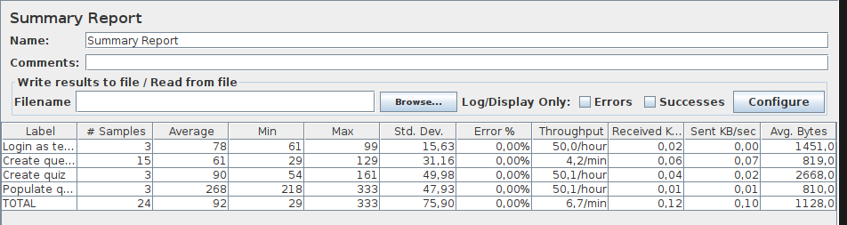

# ES21 P4 submission, Group NN

## Feature PRA

### Subgroup

 - João Oliveira, ist193728, Jonyleo
   + Issues assigned: [#237](https://github.com/tecnico-softeng/es21-g21/issues/237), [#239](https://github.com/tecnico-softeng/es21-g21/issues/239),
[#243](https://github.com/tecnico-softeng/es21-g21/issues/243), [#244](https://github.com/tecnico-softeng/es21-g21/issues/244), [#258](https://github.com/tecnico-softeng/es21-g21/issues/258), [#278](https://github.com/tecnico-softeng/es21-g21/issues/278), [#280](https://github.com/tecnico-softeng/es21-g21/issues/280), [#281](https://github.com/tecnico-softeng/es21-g21/issues/281)

 - Filipa Malta, ist193708, pipamalta
   + Issues assigned: [#252](https://github.com/tecnico-softeng/es21-g21/issues/252), [#253](https://github.com/tecnico-softeng/es21-g21/issues/253),
[#259](https://github.com/tecnico-softeng/es21-g21/issues/259), [#238](https://github.com/tecnico-softeng/es21-g21/issues/238), [#273](https://github.com/tecnico-softeng/es21-g21/issues/273)

### Pull requests associated with this feature

The list of pull requests associated with this feature is:

 - [PR #249](https://github.com/tecnico-softeng/es21-g21/pull/249)
 - [PR #255](https://github.com/tecnico-softeng/es21-g21/pull/255)
 - [PR #257](https://github.com/tecnico-softeng/es21-g21/pull/257)
 - [PR #261](https://github.com/tecnico-softeng/es21-g21/pull/261)
 - [PR #274](https://github.com/tecnico-softeng/es21-g21/pull/274)
 - [PR #279](https://github.com/tecnico-softeng/es21-g21/pull/279)
 - [PR #282](https://github.com/tecnico-softeng/es21-g21/pull/282)

### Listed features

Below, we list **only** the implemented features. For each feature, we link the relevant files and we mark which are requested parts are completed.

#### Feature number 1: Student answer a quiz

 - [x] [Service](https://github.com/tecnico-softeng/es21-g21/tree/develop/backend/src/main/java/pt/ulisboa/tecnico/socialsoftware/tutor/answer)
 - [x] [Service tests](https://github.com/tecnico-softeng/es21-g21/blob/develop/backend/src/test/groovy/pt/ulisboa/tecnico/socialsoftware/tutor/answer/service/OpenAnswerQuestionQuiz.groovy)
 - [x] [Webservice tests](https://github.com/tecnico-softeng/es21-g21/blob/2fce27f1d201dab507bc2438df06a922f33573f9/backend/src/test/groovy/pt/ulisboa/tecnico/socialsoftware/tutor/answer/webservice/OpenAnswerQuestionQuizIT.groovy#L70)

#### Feature number 2: Student see her quiz results

 - [ ] [Service]()
 - [ ] [Service tests]()
 - [x] [Webservice tests](https://github.com/tecnico-softeng/es21-g21/blob/2fce27f1d201dab507bc2438df06a922f33573f9/backend/src/test/groovy/pt/ulisboa/tecnico/socialsoftware/tutor/answer/webservice/OpenAnswerQuestionQuizIT.groovy#L102)

#### Feature number 3: Teacher see quiz results

 - [ ] [Service]()
 - [ ] [Service tests]()
 - [x] [Webservice tests](https://github.com)
   
#### Feature number 4: Teacher export quiz

 - [x] [Service](https://github.com/tecnico-softeng/es21-g21/blob/2fce27f1d201dab507bc2438df06a922f33573f9/backend/src/main/java/pt/ulisboa/tecnico/socialsoftware/tutor/impexp/domain/AnswersXmlExportVisitor.java#L158)
 - [ ] [Service tests]()
 - [x] [Webservice tests](https://github.com)
   
##### Test Coverage Screenshot

The screenshot includes the test coverage results associated with the new/changed entities:

### Cypress end-to-end test

- [x] [Cypress use case test](https://github.com/tecnico-softeng/es21-g21/blob/develop/frontend/tests/e2e/specs/teacher/manageOpenAnswerQuizExcution.js)

### JMeter Load test

Each subgroup member defined one reading test and one writing test. The direct links to these are:

- [LoadJMeter](https://github.com/tecnico-softeng/es21-g21/blob/develop/backend/jmeter/answer/quiz-answer-open-answer.jmx)

#### Screenshots of Reports

